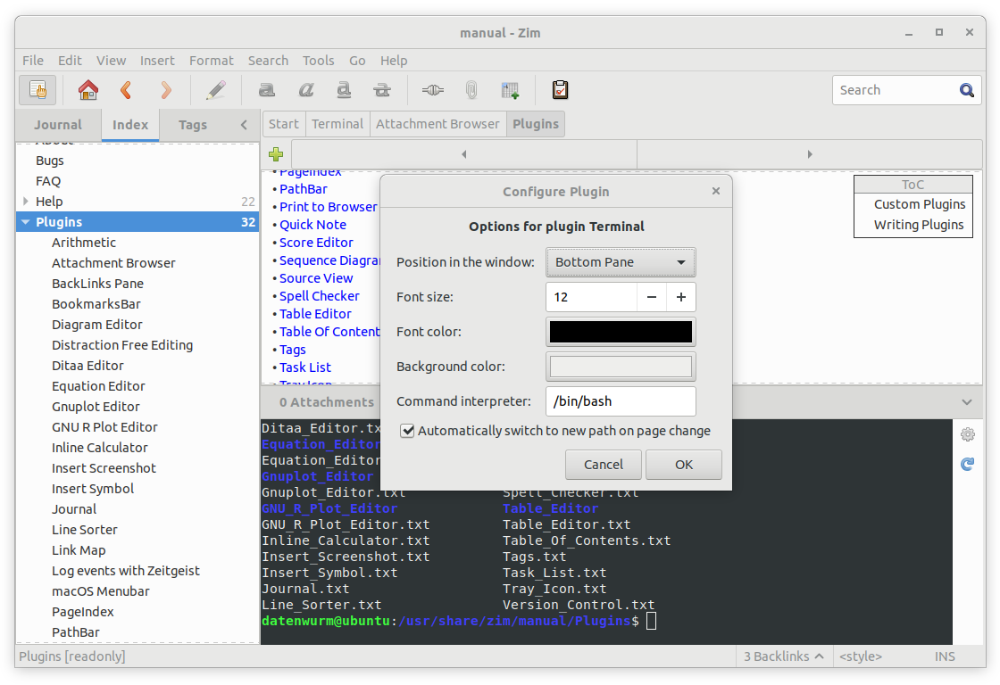

# Zim Terminal Plugin

This plugin shows a terminal at the bottom pane.

# Setup

1. Put the `terminal.py` into the plugins folder e.g. `%appdata%\zim\data\zim\plugins` in Windows, or `~/.local/share/zim/plugins/` in Linux.
2. Enable the plugin in Zim via `Edit > Preferences > Plugins` and check mark the `Terminal` plugin.

# Platforms

* Linux
* MacOS
* Windows
